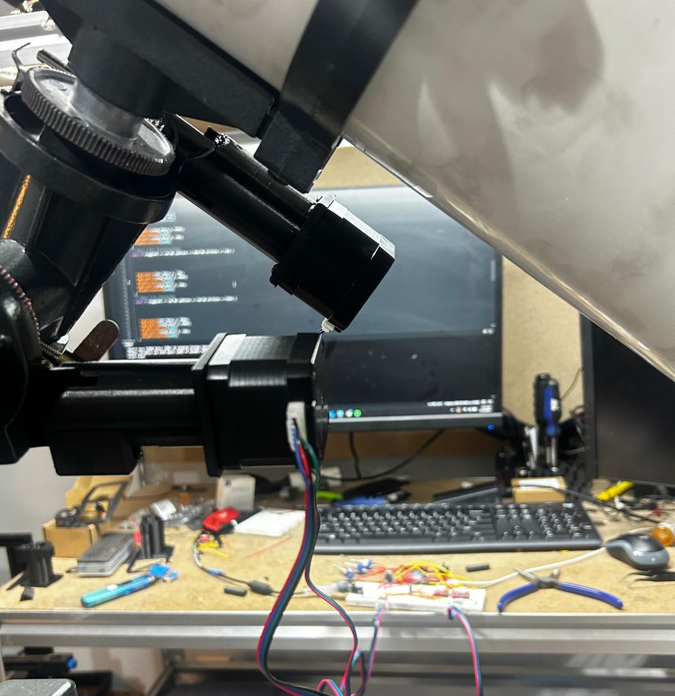

# Telescope-mount-tracking-retrofit-

This project involved designing a motorized retrofit for a telescope mount that preserves the original mount geometry while adding precise tracking capability. The gear train and motor attachment points were engineered to conform to the existing structure, allowing the system to integrate without altering the base mount.

Separate motorized assemblies were designed for polar (RA) and sidereal/declination axes, preventing wire entanglement during continuous motion. The control architecture uses a master Arduino UNO R4 coordinating multiple slave Arduino Nano controllers, with wireless communication via nRF transceivers to enable distributed control.

In addition to mechanical design, the project included custom circuit design and power distribution, ensuring reliable motor operation, stable logic-level control, and modular expandability. The result is a compact, geometry-preserving, and scalable tracking system suitable for astronomical observation and astrophotography.
