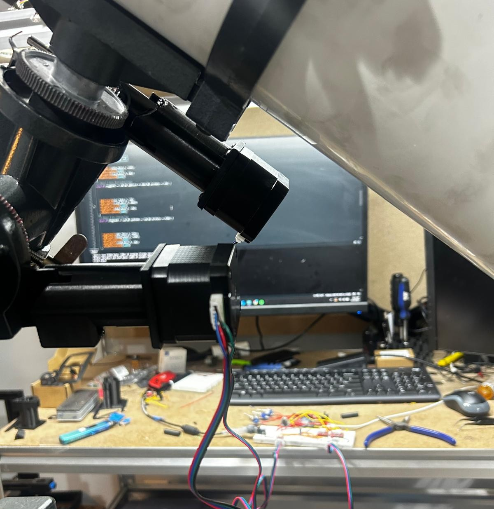
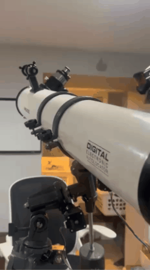
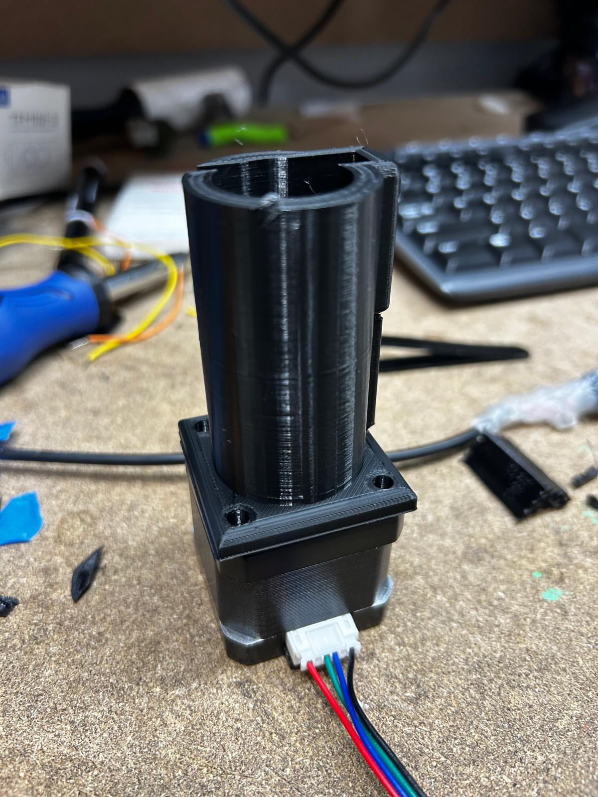
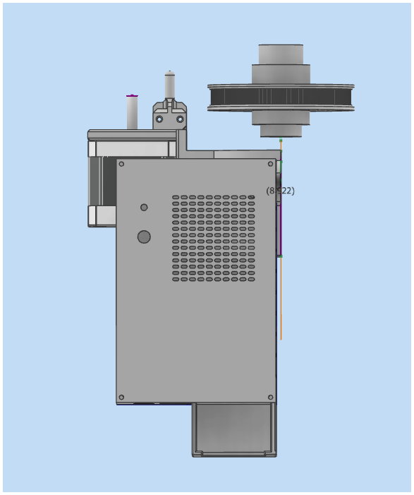
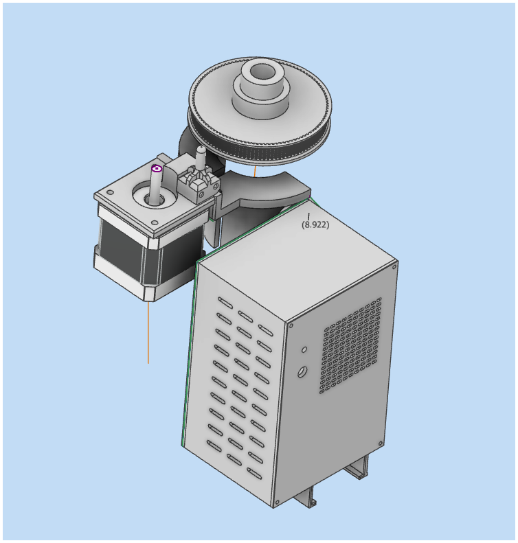
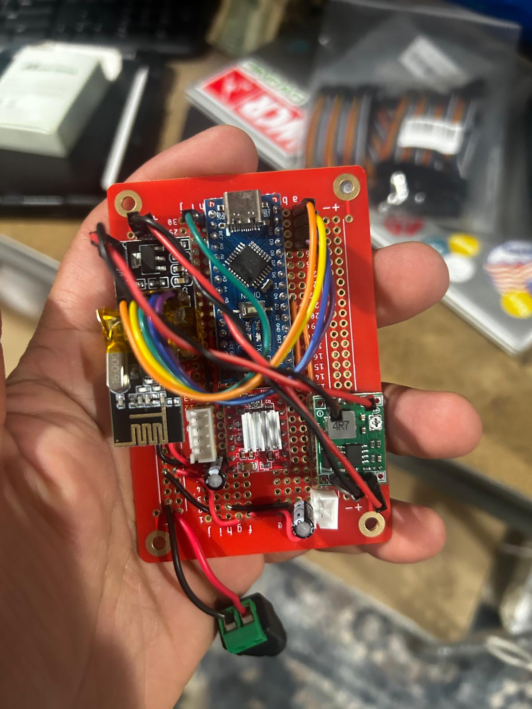

    
  <im>Fig. 1. Testing initial prototype</im>

I have a very old reflector telescope that I used for observing the night sky; however, it was starting to become a bit unstable, and the original tracking motors no longer worked.
I decided to modernize it by adding stepper motors and microcontrollers so I could use the telescope for astrophotography.

The main challenge was designing a retrofit that could attach to the existing geometry. I accomplished this by carefully measuring the areas where the stepper motors would mount, then iterating the design until I arrived at a satisfactory prototype.

   
  <im>Fig. 2. more testing of initial prototype.</im>

   
  <im>Fig. 2. First iteration of stepper module.</im>

  
A major problem in this project was cable management. Since the tripod is made of several rotating parts, there was a risk of the cables becoming tangled. For this reason, I used RF transceivers so that three modules could communicate wirelessly with each other.

In this configuration, the master microcontroller enables wireless control of two slave modules capable of adjusting the polar and declination angles via stepper motors. I used a joystick as well as mode switches (coarse, normal, fine) to control the direction and speed of rotation.

   
  <im>Fig. 4 Second design iteration.</im>

   
  <im>Fig. 5 attachment piece, pulleys and control box.</im>

  
In Figures 4 and 5, we can observe significant changes to the project. Initially, the telescope was driven via a worm gear; however, this was later modified to a pulley and driver system because this configuration was more compact. Additionally, a box was added to the prototype. This box serves as protection for the circuitry as well as the battery.

The box also features holes to allow for heat dissipation, since the stepper drivers produce a moderate amount of heat.

   
  <im>Fig. 6 Stepper driver, RF module, buck converter and microcontroller.</im>

  

### For more information and files about this project, please visit the <a href="https://github.com/eliasreyess/Telescope-mount-tracking-retrofit-">repository.</a>

  

